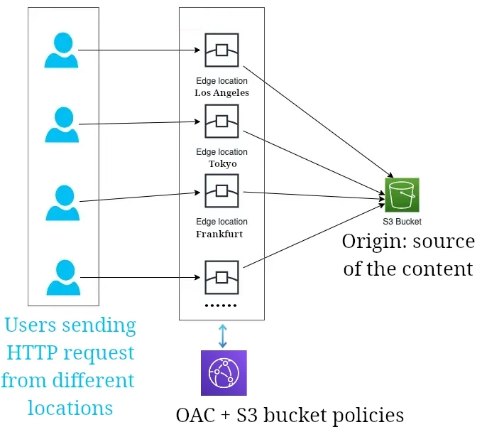

# CloudFront

- Global service.
- Content Delivery Network (CDN).
- Caching frequently requested content at the edge locations.
- DDoS protection through WAF & Shield.
- Origins[^1]:
  - S3 Bucket: send[^2] and cache files at the edge locations.
    - Control access with OAC (Origin Access Control).
  - Application Load Balancer.
  - EC2 instance.
  - static websites hosted on S3 .
  - HTTP backend.
- For deleting a distribution you need to first disable it and then wait for being deployed. After that you can delete it permanently.

## How it works

## S3 as an origin

### S3 replication VS CloudFront caching

| CloudFront                           | S3 cross region replication             |
| ------------------------------------ | --------------------------------------- |
| Utilizes global edge network of AWS. | Needs to be configured for each region. |
| Caches have TTL[^3].                 | Files are replicated (not cached).      |
| Good for static content.             | Good for dynamic content.               |

## Footnotes

[^1]: An origin is the location where content is stored, and from which CloudFront gets content to serve to viewers.

[^2]: It is called ingres.

[^3]: Time To Live.
