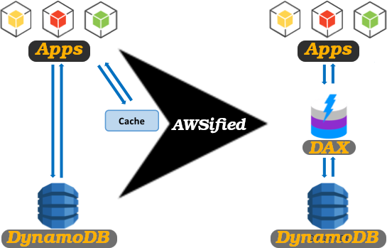
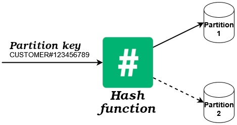

# DynamoDB

- Managed service.
  - You start by creating tables and not database itself.
- NoSQL DBMS.
  - Try to avoid needing relations and joins.
  - Check the [learn more section](#learn-more).
- Scalable.
- Distributed serverless database.
- Low [latency](../glossary.md#latencyGlobalGlossary) retrieval.
- We can activate its Auto Scaling feature.
- We can run it locally too on Docker ([learn more](https://docs.aws.amazon.com/amazondynamodb/latest/developerguide/DynamoDBLocal.html)).
- Encrypts your Data at REST, meaning if someone goes to an AWS data center and tears out a drive, the data stored on it is encrypted.

## Encryption VS Hashing

Suppose you have a `password` field. Now we know that AWS DynamoDB encrypts my data before storing it on the physical hard drive but when my AWS admins are fetching data AWS will send a decrypted version, so they can see it in plain text.

But that's not the point, what we need to do is hashing our `password` field with a resilient algorithm against [ASICs](https://en.wikipedia.org/wiki/Application-specific_integrated_circuit) attacks. For example [Argon2](https://en.wikipedia.org/wiki/Argon2), you can find its implementation in JS [here](https://github.com/ranisalt/node-argon2).

## Encryption

Sometimes we have regulatory compliance requirements that asks us to encrypt data on top of data being encrypted at REST.

> [!TIP]
>
> It's a good idea to always know what kind of regulations do we need to meet.

## DynamoDB Accelerator -- DAX

- A managed service.
- An in-memory caching solution for DynamoDB.

## Partition Key, Sort Key, and Primary Key

- Partition key:

  - What determines in which partition data should be stored.

    

- Sort key:
  - Dictates records sorting in each partition.
- Primary key:
  - A unique identifier for each document in my DynamoDB.
  - Can be:
    - A normal primary key: partition key.
    - A composite key: partition key + sorting key.

> [!TIP]
>
> Your primary key needs to be selected in a way that it is not gonna create hot partitions where one or a couple of partitions have to handle a lot of data while others do not have much data.

# Learn more

- [DynamoDB Basics, Part 1](https://dev.to/aws-builders/dynamodb-basics-part-1-4e4i).
- [How can I join tables in AWS DynamoDB?](https://stackoverflow.com/questions/36753861/how-can-i-join-tables-in-aws-dynamodb).
