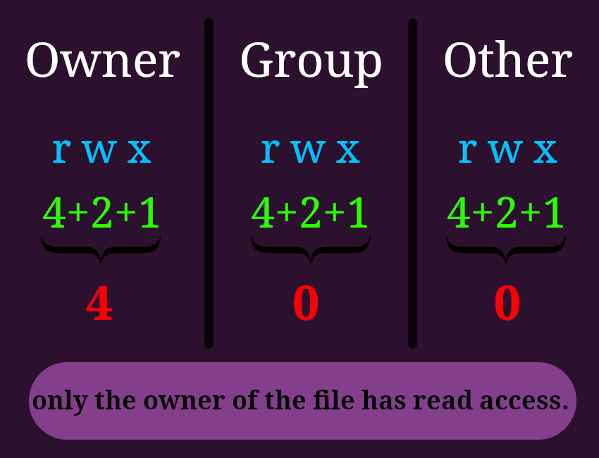
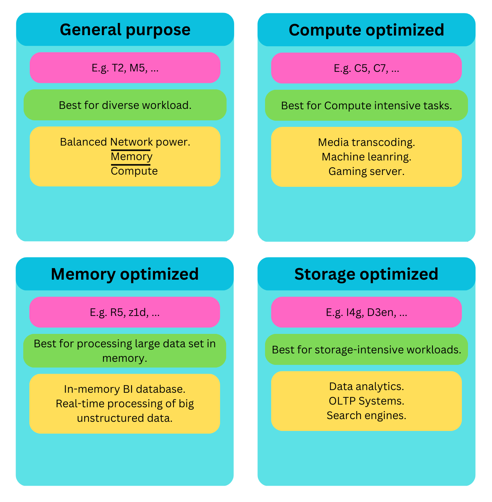
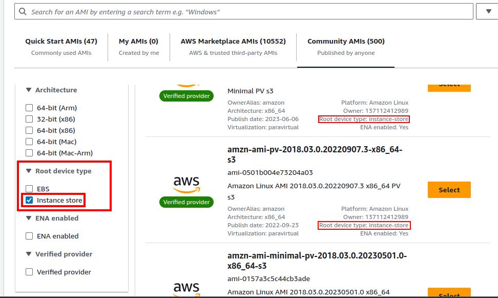
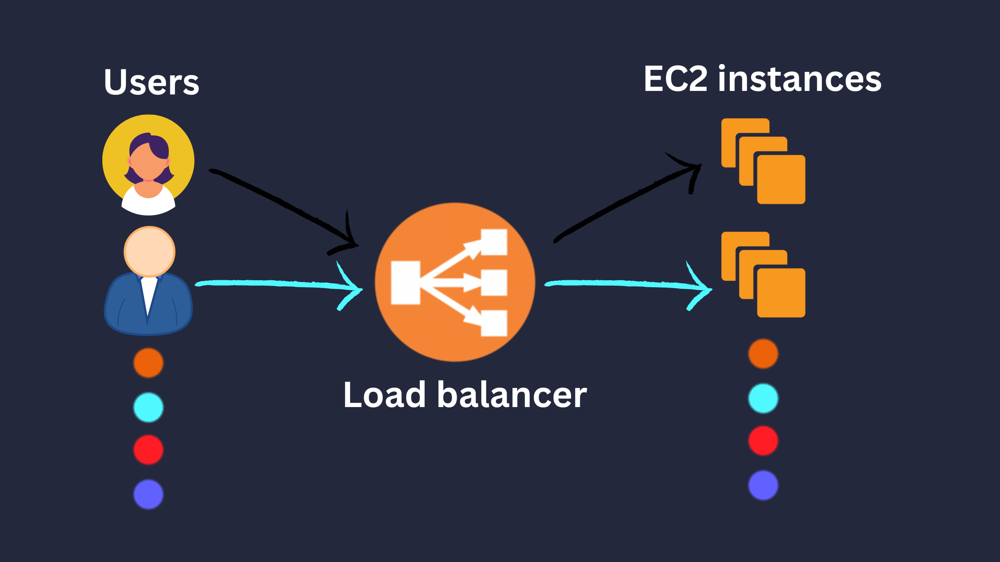
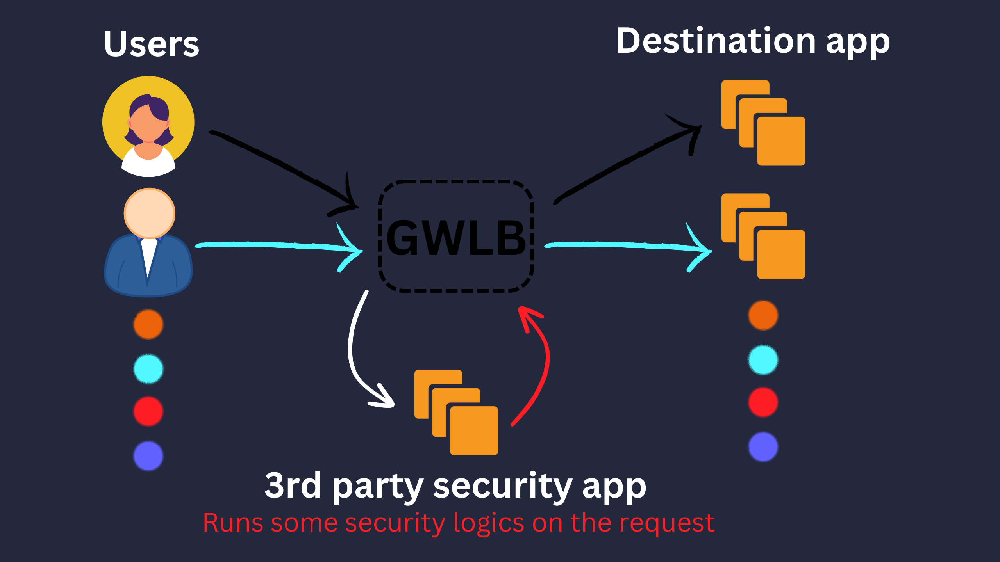
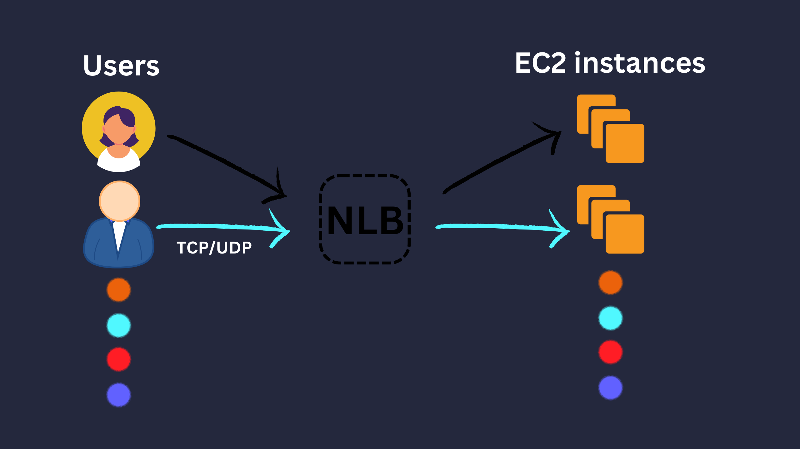
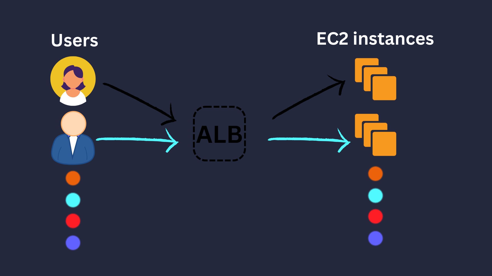

# EC2

- Stands for Elastic Compute Cloud.
- Foundation of cloud computing.
- Falls under IaaC category.
- Configurable OS, CPU, RAM, Storage, Network, Firewall.
- Optional: Specify a bootstrap script.
  - Install updates/softwares/libraries.
  - Download something from internet.
  - AKA "User Data Script".
  - Executes commands as root user (No need to prepend your commands with `sudo`).
- Optional: Create or specify which key pair you'll be using to connect to the EC2 instance via SSH.

  - Available options: ED25519, RSA.
  - AWS will copy the pub key automatically inside the EC2 instance.
  - AWS will create a default username for us called `ec2-user`, `root`, `ubuntu`, and a few others. It depends on the distribution you choose ([learn more](https://docs.aws.amazon.com/AWSEC2/latest/UserGuide/managing-users.html#ami-default-user-names)).
  - Do not forget to change the `.pem` file access permissions to "0400".

  

- We can select different OS images:

  - E.g. AMI, Ubuntu, Windows, macOS, Debian.
  - AMI Comes with preinstalled `aws`.

    > [!CAUTION]
    >
    > Do not configure your `aws` here (`aws configure`), It poses a lot of security risks and hard to debug. Because we cannot track exactly who, with which access rights did what.

  - AMI:

    - Stands for Amazon Machine Image.
    - They're customized EC2 instances.
    - They're bound to a region.
    - To create one:

      1. Launch an EC2 instance.
      2. Customize it: do whatever you need inside it/through "user data".
      3. Stop it (For data integrity's sake).

         > [!CAUTION]
         >
         > If you're EC2 instance cannot be stopped then when you wanna build AMI you need to check "No Reboot" so that the machine stays up.

      4. Build AMI (this step creates snapshots).

    - EC2 image builder:
      - Automates:
        - AMI creation.
        - Maintenance (update OS, libs, etc).
        - Validation (it is working the way it is intended to).
      - This is a free separate service.
        - We'll pay of course for the underlying resources that will be used.

  - We can use IAM roles to let our EC2 instance work with other services.
    1. Create a role with necessary permissions.
    2. Assign the role to the EC2 instance via AWS console:
       1. Open your console.
       2. Select the EC2 instance you wanna assign the role to it.
       3. "Actions -> Security -> Modify IAM role".

## EC2 service components

- EC2 instances: Essentially leased virtual machines.
- [EBS](#ebs) - Elastic [Block Storage](#blockStorageGlossary): stores data on virtual drives.
- [ELB](#elb) - Elastic Load Balancer: balances load on EC2 instances.
- ASG - Auto Scaling Group: Scale EC2 instances.

## Most used EC2 instance types

## Purchasing options for EC2 instances

<table>
  <thead>
    <tr>
      <th>Type</th>
      <th>Description</th>
      <th>Good for</th>
    </tr>
  </thead>
  <tbody>
    <tr>
      <td>On-demand</td>
      <td>Pay for compute capacity by the second.</td>
      <td>
        <ul>
          <li>Short workload.</li>
          <li>Uninterrupted workload.</li>
        </ul>
      </td>
    </tr>
    <tr>
      <td>Reserved Instances</td>
      <td>Runs for a specific period.</td>
      <td>
        <ul>
          <li>Long workload.</li>
          <li>Steady-state usage.</li>
        </ul>
      </td>
    </tr>
    <tr>
      <td>Convertible Reserved Instance</td>
      <td>Similar to reserved instances.</td>
      <td>
        When you probably need to change instance:
        <ul>
          <li>OS.</li>
          <li>Scope.</li>
          <li>Tenancy family.</li>
          <li>Type.</li>
        </ul>
      </td>
    </tr>
    <tr>
      <td>Saving Plans</td>
      <td>You commit to a consistent amount of usage ($/h).</td>
      <td>
        <ul>
          <li>When you can predict usage ($/h).</li>
          <li>E.g. ECommerce websites with known peak times.</li>
        </ul>
      </td>
    </tr>
    <tr>
      <td>Spot Instances</td>
      <td>
        <ul>
          <li>Most cost-effective.</li>
          <li>If your instance crosses the defined max price, you'll lose it instantly.</li>
          <li>Bad idea for critical tasks (e.g. DB).</li>
        </ul>
      </td>
      <td>When your workload has the attribute of being <b>resilient to failure</b>.</td>
    </tr>
    <tr>
      <td>Dedicated Host</td>
      <td>A complete, actual server.</td>
      <td>
        <ul>
          <li>When you need <a href="#byolGlossary">BYOL</a> support.</li>
          <li>Complying with regulatory requirements (e.g. software isolation).</li>
        </ul>
      </td>
    </tr>
    <tr>
      <td>Dedicated Instances</td>
      <td>Dedicated hardware, though it might be shared with other EC2 instances from the same account.</td>
      <td>When you need dedicated hardware.</td>
    </tr>
    <tr>
      <td>Capacity Reservation</td>
      <td>
        <ul>
          <li>On-demand.</li>
          <li>Charged whether you're using it or not.</li>
          <li>Use saving-plans to get discount, no discount on its own.</li>
        </ul>
      </td>
      <td>
        <ul>
          <li>Need immediate access to hardware (ASG).</li>
          <li>Implementing highly available architecture.</li>
          <li>Supporting predictable traffic spikes (e.g. Black Friday, marketing campaigns).</li>
          <li>Crucial component of disaster recovery plan.</li>
        </ul>
      </td>
    </tr>
  </tbody>
</table>

## Features

- Security groups (SG):

  - It is like a virtual firewall.
  - Filters and manages traffics that reaches <small>(Go in (inbound) or out(outbound))</small> EC2 instance.
  - Can reference each other.
  - **KISS**: Do not overuse it.
  - 

  > [!TIP]
  >
  > How to debug your network issues:
  >
  > - Got timeout error? security group is involved directly.
  > - Got a connection refused error? Check your own application.
  >
  > Define a separate security group for SSH access and reuse it wherever needed.

- Elastic Block Store (EBS):

  - Attachable **network drive** (they ain't physical).
  - Persistent [block storage](#blockStorageGlossary).
  - Limitations:
    - Performance (for higher performance use <a href="ec2InstanceStore">EC2 instance store</a>).
    - Mountable to one instance at a time (for being able to mount one storage to multiple EC2 instance look at [EFS](../EFS/README.md)).
    - Bound to a specific AZ (use [EFS](../EFS/README.md) if you need to share same storage across AZs).
  - 4 different volume types:

    <table>
      <thead>
        <tr>
          <th></th>
          <th colspan="2">SSD</th>
          <th colspan="2">HDD</th>
        </tr>
        <tr>
          <th></th>
          <th>gp2/gp3</th>
          <th>io1/io2</th>
          <th>sc1</th>
          <th>st1</th>
        </tr>
      </thead>
      <tbody>
        <tr>
          <th>Full name</th>
          <td>General Purpose solid-state drives (SSD)</td>
          <td>Provisioned <a href="../glossary.md#iopsGlobalGlossary">IOPS</a> SSD.</td>
          <td>Cold hard disk drive (HDD) volume.</td>
          <td>Throughput optimized hard disk drive (HDD) volume.</td>
        </tr>
        <tr>
          <th>Ideal for</th>
          <td>A broad range of transactionl workloads.</td>
          <td>
            <ul>
              <li>Low latency is a must.</li>
              <li>IOPS-intensive workloads.</li>
              <li>Mission-critical workloads.</li>
              <li>Performance-intensive workloads.</li>
            </ul>
          </td>
          <td>
            Infrequently accessed, throughput-intensive workloads with large
            datasets and large I/O sizes
          </td>
          <td>
            Frequently accessed, throughput-intensive workloads with large datasets
            and large I/O sizes.
          </td>
        </tr>
        <tr>
          <th>Merits</th>
          <td>
            <ul>
              <li>
                Indefinitely sustain their full provisioned
                <a href="../glossary.md#iopsGlobalGlossary">IOPS</a> and
                <a href="#throughputGlossary">throughput</a> performance.
              </li>
              <li>
                Cost-effective.
              </li>
            </ul>
          </td>
          <td>
            <ul>
              <li>Provided low latency.</li>
              <li>Highest performance for EBS.</li>
              <li>Can be attached to multiple EC2 instances.</li>
            </ul>
          </td>
          <td>Low-cost magnetic storage.</td>
          <td>
            <ul>
              <li>Low cost.</li>
              <li>Higher throughput than SC1.</li>
            </ul>
          </td>
        </tr>
        <tr>
          <th>Examples</th>
          <td>
            <ul>
              <li>Virtual desktops.</li>
              <li>Medium-sized single instance databases.</li>
              <li>Latency sensitive interactive applications.</li>
              <li>Development and test environments.</li>
            </ul>
          </td>
          <td>
            MySQL, MongoDB.
             
            <a
              href="https://www.percona.com/blog/use-provisioned-iops-volumes-for-aws/"
            >
              &mdash; Ref.
            </a>
          </td>
          <td>
            <ul>
              <li>Log processing.</li>
              <li>Hadoop clusters.</li>
              <li>Windows File Server.</li>
              <li>big data workloads with large data sets.</li>
            </ul>
          </td>
          <td>
            <ul>
              <li>ETL.</li>
              <li>Kafka.</li>
              <li>Amazon EMR.</li>
              <li>Log processing.</li>
              <li>Data warehouses.</li>
            </ul>
          </td>
        </tr>
      </tbody>
    </table>

  - They are deleted on EC2 instance termination, unless you [configure them to not to](https://docs.aws.amazon.com/AWSEC2/latest/UserGuide/preserving-volumes-on-termination.html).
  - EBS snapshot:
    - Taking backup.
    - When you wanna take a backup/snapshot it is **recommended** to detach EBS volume first.
    - You can move snapshots between regions.
      - Can be used for disaster recovery: Take snapshot in region1 and them copy it in several regions, then when needed just restore them.
    - Archive snapshots.
      - Cheaper.
      - They need more time to be restored (up to 3 hour).
    - Recycle bin.
      - Define a retention rule.
      - Retention rule: For how long we wanna keep the deleted snapshot.
    - Can **increase** the size of created EBS volume from snapshot.

- EC2 instance store

  - A physical hard drive installed on the hardware that our EC2 instance is running on.
  - You need to go to the "Community AMIs" when browsing for an OS with instance type storage:

    

    - Better I/O:
      - High throughput.
      - High disk performance.
    - Ephemeral:
      - Stopping or terminating EC2 = Losing data.
      - Good for buffer, cache, temp data.
    - We can get backup from them.

- Load balancer:

  - Manged service.
  - What we'll expose publicly.
  - Forwards internet traffic to multiple EC2 instances.

    

  - What it does for us:
    1. Load spreading.
    2. SSL termination.
    3. Performs regular health checks.
    4. Provides a single point of access (DNS).
    5. Won't send load to unhealthy EC2 instances.
    6. High-availability across zones by having one load balancer.
  - It is cheaper to have an on-premise[^2] load balancer.
  - It can be:

    <table>
      <thead>
        <tr>
          <th></th>
          <th>Network Load Balancer</th>
          <th>Gateway Load Balancer</th>
          <th>Application Load Balancer</th>
        </tr>
      </thead>
      <tbody>
        <tr>
          <th>AKA</th>
          <td>GLB</td>
          <td>NLB</td>
          <td id="alb">ALB</td>
        </tr>
        <tr>
          <th>Works on which OSI layer</th>
          <td>Layer 3: GENEVE protocol</td>
          <td>Layer 4: TCP/UDP protocol</td>
          <td>Layer 7: HTTP, HTTPS, RPC protocol</td>
        </tr>
        <tr>
          <th>Known for</th>
          <td>
            Routing traffics to my firewalls (on EC2 instances) to detect intrusion
            for example.
          </td>
          <td>
            Its high performance: it can route millions of requests per second.
          </td>
          <td>HTTP routing features.</td>
        </tr>
        <tr>
          <th>Requirements</th>
          <td>A separate EC2 instance where checks the requests.</td>
          <td>Static IP</td>
          <td>Static DNS</td>
        </tr>
        <tr>
          <th>Infographic</th>
          <td></td>
          <td></td>
          <td></td>
        </tr>
      </tbody>
    </table>

  - To create a load balancer:
    1. Create a security group (based on IP, port, or protocol).
    2. Create a target group (instances we wanna load balance).
  - Elastic Load Balancing (EBS):

    - Distributes the workload between EC2 instances in an ASG.

- Auto Scaling Group:

  - To scale[^1] we have 2 options:

    <table>
      <thead>
        <tr>
          <th></th>
          <th>Vertical Scaling</th>
          <th>Horizontal Scaling</th>
        </tr>
      </thead>
      <tbody>
        <tr>
          <th>How it works</th>
          <td>Increase the size (e.g. t2.micro => t2.large).</td>
          <td>Increase the number of instances.</td>
        </tr>
        <tr>
          <th>Considerations</th>
          <td>Limited (Cannot be scaled indefinitely).</td>
          <td>
            <ul>
              <li>
                <b>Distributed systems</b>: more work regarding data integrity and
                other aspects of a distributed system.
              </li>
              <li>
                <b>High-availability</b>: aliged with
                <a href="../glossary.md#elasticityGlobalGlossary">Elasticity</a>.
              </li>
              <li>
                You can setup your ASG template to provision new EC2 instances
                in different AZs.
              </li>
            </ul>
          </td>
        </tr>
        <tr>
          <th>AKA</th>
          <td>Scale up/down.</td>
          <td>Scale out/in.</td>
        </tr>
      </tbody>
    </table>

### Local zones

## Shared responsibility model

| AWS                        | User                                 |
| -------------------------- | ------------------------------------ |
| Infrastructure.            | Security group rules.                |
| Replacing faulty hardware. | OS maintenance.                      |
| Compliance validation.     | Data security.                       |
| Data replication for EBS.  | IAM roles/users (Access management). |

## Glossary

<dl>
  <dt id="#throughputGlossary">
    Throughput:
  </dt>
  <dd>
    The ability to process a large volume of data transfer operations per seconds. Reading and writing speed to the storage volume.
  </dd>
  <dt id="blockStorageGlossary">
    Block storage:
  </dt>
  <dd>
    <ul>
      <li>
        Commonly used storage technology used in cloud computing.
      </li>
      <li>
        Store data in fixed-sized blocks.
        <ul>
          <li>
            Each block has a unique ID.
          </li>
          <li>
            Because of this it is very scalable.
          </li>
        </ul>
      </li>
    </ul>
  </dd>
  <dt id="#byolGlossary">
    BYOL:
  </dt>
  <dd>
    <ul>
      <li>Bring Your Own License.</li>
      <li>
        A licensing model that lets companies use their licenses flexibly, whether on-premise, or in the cloud.
      </li>
    </ul>
  </dd>
</dl>

## Footnotes

[^1]: Application/system can handle more loads by adapting.

[^2]: Self-hosted or on an EC2 instance.
