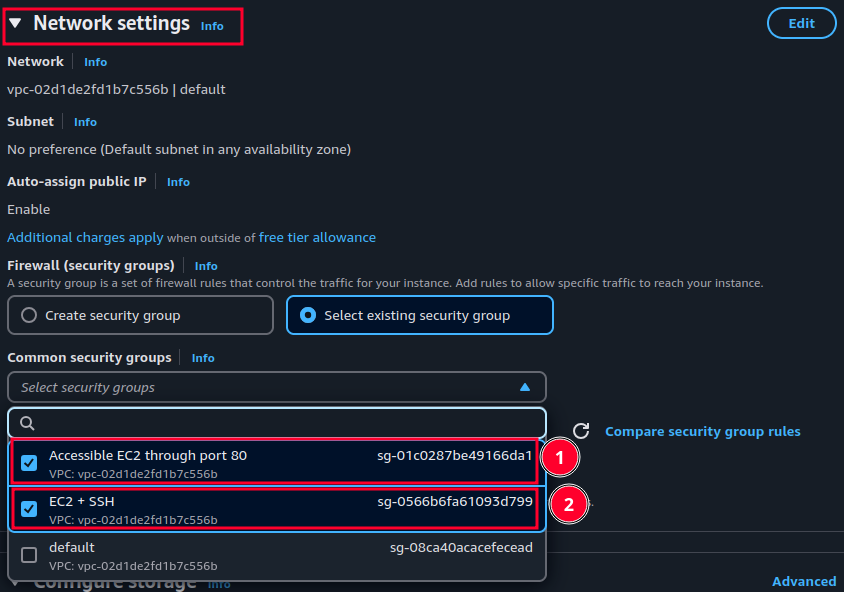

# Launching an instance

1. Go to ["EC2" dashboard](https://eu-central-1.console.aws.amazon.com/ec2/home).

   > [!NOTE]
   >
   > This is a direct link to "eu-central-1" availability zone. So you might wanna just search it.

2. Click on "Launch instance":

   

3. Give it a name:

   

4. Choose an appropriate OS for your use case, here I am choosing Ubuntu:

   

5. Specify how much resource you need (Instance type), here I choose one that is free.

   

6. If you wanna be able to connect to your EC2 instance choose/create a key pair, here I'll use the one that I have created before ("AmazonLinuxEC2InstanceKeyPair"):

   

7. If you specified a key pair in the previous step now you need to also [choose/create a security group](./security-groups.md#create-a-security-group) where SSH is open. Thus we can access our EC2 instance. in the network settings section:

   

   > [!NOTE]
   >
   > If you've created a new security group you need to add SSH to your inbound rules in "security groups" dashboard.

8. Then you need to configure your EC2 instance's storage:

   

9. Lastly click on "Launch instance".

   

   > [!NOTE]
   >
   > We did not change any advance setting here but you can set them to what serves your needs.
