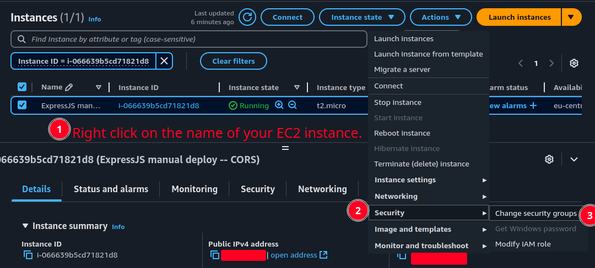
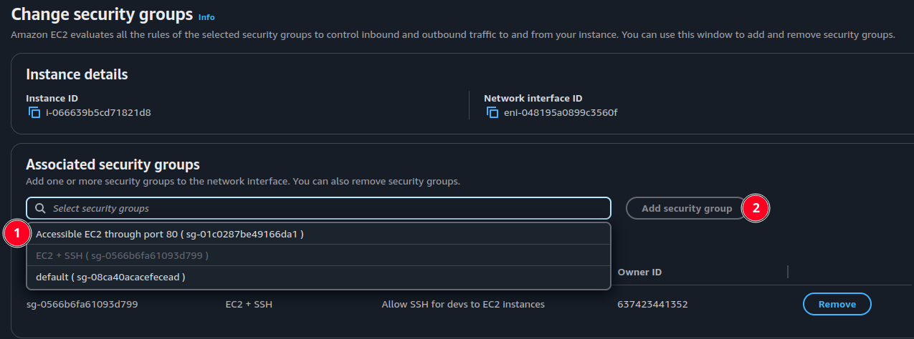

# Security groups

- A virtual firewall around our EC2 instance
- They're:
  - Associated with _network interfaces_.
  - Stateful.
- <a id="leastPrivilegeBaseline" href="#leastPrivilegeBaseline">#</a> Can only ALLOW.
  - This is [principle of least privilege](./glossary.md#principleOfLeastPrivilege).
- Can reference other security groups.

## Create a security group

1. Go to ["Security Groups" dashboard](https://eu-central-1.console.aws.amazon.com/ec2/home).

   > [!NOTE]
   >
   > This is a direct link to "eu-central-1" availability zone. So you might wanna just search it.

2. Click on "Create security group" button:

   

3. Pick a meaningful name, write a good description.

   

4. Add allowed inbound rules, remember that AWS works with [least privilege principle as baseline](#leastPrivilegeBaseline), for example here we have exposed SSH port to the world.

   

5. Then it is time to specify to where your EC2 instance can send a request -- "Outbound rules":

   

6. Finally add some tags [if you need any](../README.md#tags-in-aws).

   

## Attach a new security group to an EC2 instance

### Opening port 80 of an EC2 instance

Assume we need to allow an existing EC2 instance to be accessible through port 80.

1.  To do this we need to create a new security group which allows inbound requests from port 80.
2.  Then we can attach the newly create security group to our EC2 instance:

    

3.  Then you can find the new security group and attach your EC2 instance to it.

    

4.  Click on "save" button to apply changes. Now if you go to inbound rules tab of your EC2 instance you can see that now your EC2 instance is accessible through port 80 and 22.
