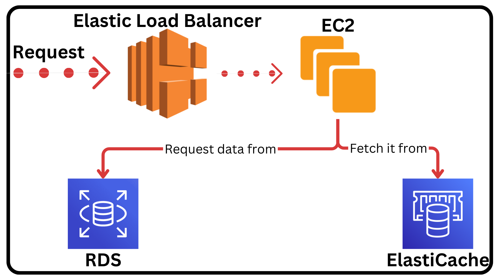

# [ElastiCache](https://aws.amazon.com/elasticache/)

- Managed [Redis](https://redis.io)/[Memcached](https://memcached.org/).
- Like our EC2 instance ElastiCache can have the [Auto Scaling Group](../glossary.md#autoScalingGroupGlobalGlossary) enabled.

