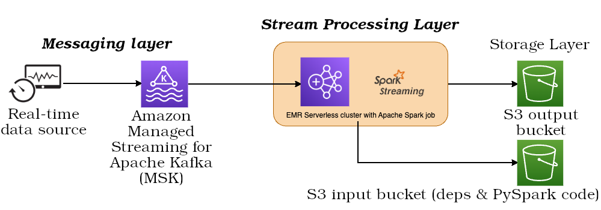

# EMR

- Acronym of Elastic MapReduce.
- Help you to analyze & process big data.
- A managed service.
- Creates Hadoop clusters with preinstalled, optimized, configurable open-source frameworks to process your big data.
- Supports [Apache Spark](https://spark.apache.org/), [HBase](https://hbase.apache.org/), [Presto](https://prestodb.io/), etc.
- Good for things like ML, or web indexing.
- Have features like Auto Scaling, and can be also can be integrated with spot instances.

