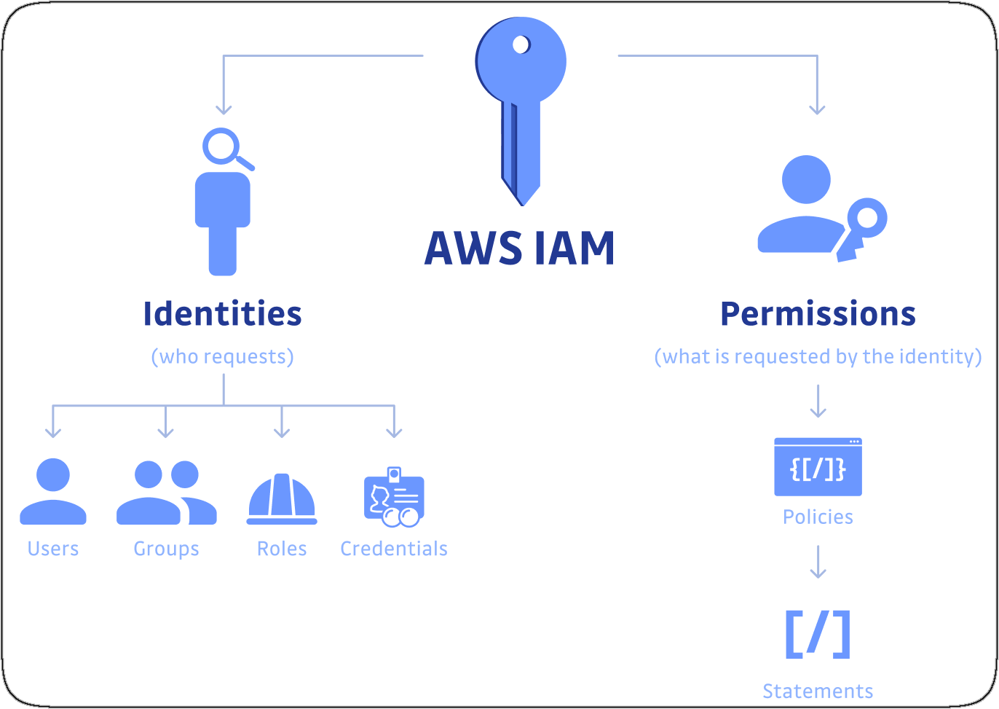
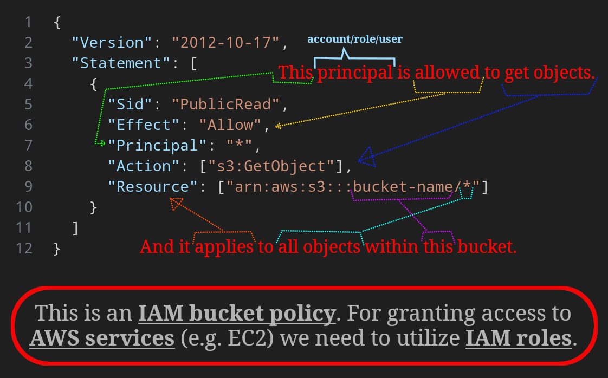
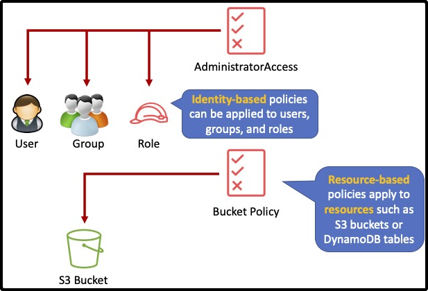

# IAM



- Acronym of Identity & Access Management.
- A global service.
- In IAM we have

  - <a id="userDefinitionInIam" href="#userDefinitionInIam">#</a> User:
    - A person in an organization.
  - <a id="groupDefinitionInIam" href="#groupDefinitionInIam">#</a> Group:
    - A wrapper around users.
    - Each user can be in more than one group.
    - You do not have to add a user to a group, but it is recommended to do so since managing groups is easier than individual users.
  - <a id="permissionDefinitionInIam" href="#permissionDefinitionInIam">#</a> Permissions:

    - Assignable to user/group.
    - Specify what one can do.
    - Format: JSON.
    - AKA policies.
    - Follow least privilege principle: [learn more](https://docs.aws.amazon.com/wellarchitected/latest/framework/sec_permissions_least_privileges.html), in short it's about giving the minimum permission needed.
    - E.g.:

      ```json
      {
        "Id": "cd3ad3d9-2776-4ef1-a904-4c229d1642ee",
        "Version": "2012-10-17",
        "Statement": [
          {
            "Sid": "ListAndDescribe",
            "Effect": "Allow",
            "Action": [
              "dynamodb:List*",
              "dynamodb:DescribeReservedCapacity*",
              "dynamodb:DescribeLimits",
              "dynamodb:DescribeTimeToLive"
            ],
            "Resource": "*"
          },
          {
            "Sid": "SpecificTable",
            "Effect": "Allow",
            "Action": [
              "dynamodb:BatchGet*",
              "dynamodb:DescribeStream",
              "dynamodb:DescribeTable",
              "dynamodb:Get*",
              "dynamodb:Query",
              "dynamodb:Scan",
              "dynamodb:BatchWrite*",
              "dynamodb:CreateTable",
              "dynamodb:Delete*",
              "dynamodb:Update*",
              "dynamodb:PutItem"
            ],
            "Resource": "arn:aws:dynamodb:*:*:table/MyTable"
          }
        ]
      }
      ```

## IAM Policy Structure



- `Version`: commonly used values are "2012-10-17" and "2008-10-17".
- `Id`:
  - This is helpful to identify the policy.
  - Allowed **only** in resource-based policies.
  - Recommendation: use a UUID for the value, or incorporate a UUID as part of the ID to ensure uniqueness.
- `Statement`:

  - Main element in each policy.
  - Can be one or more: `{...}`/`[{...}, {...}]`.
  - Inside it we have:

    - `Sid`:
      - Statement ID.
      - Unique **within** a JSON policy.
      - A description for the policy statement.
      - `^[a-zA-Z0-9]+$`.
    - `Effect`:
      - Whether the statement `Allow`/`Deny` having access to a certain resource.
      - **By default** all resources have `"Effect": "Deny"`.
      - **Explicit `"Effect": "Deny"` makes that action denied regardless if there's an allow statement anywhere else**.
    - [`Principal`](https://docs.aws.amazon.com/IAM/latest/UserGuide/reference_policies_elements_principal.html):

      - Can be used in a resource-based JSON policy.
      - Specifies role/user/account that this policy applies to it.
      - `*`:
        - A wildcard.
        - Means everyone.
      - Cannot use a wildcard to match part of a principal name or ARN.
      - ```json
        {
          "Principal": {
            "AWS": ["123456789012", "555555555555"]
          }
        }
        ```
        Or
        ```json
        {
          "Principal": {
            "AWS": "arn:aws:iam::123456789012:root"
          }
        }
        ```

    - `Action`:
      - A list of actions this policy allows or denies.
      - <details><summary><b>Mandatory</b> part of each <code>Statement</code>.</summary><p>To be more precise you have to either specify this or <code>NotAction</code></p></details>
    - `Resource`:
      - A list of objects/resources for which we're specifying permissions.
      - <details><summary><b>Mandatory</b> part of each <code>Statement</code>.</summary><p>To be more precise you have to either specify this or <code>NotResource</code></p></details>

## Identity Based Policy vs Resource Based Policy


