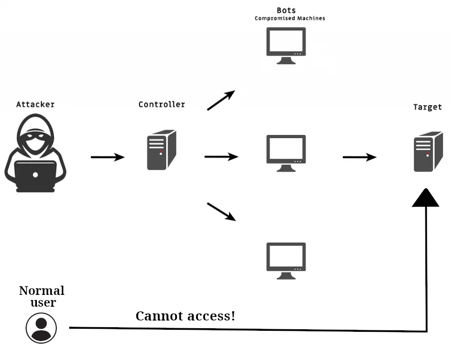

# Security

- Who is responsible for what?
  <table>
    <thead>
      <tr>
        <th>AWS</th>
        <th>Customers of AWS</th>
      </tr>
    </thead>
    <tbody>
      <tr>
        <td>Protecting infrastructure.</td>
        <td>
          Protecting your EC2 instances
          <ul>
            <li>Update your OS.</li>
            <li>Control IAM roles and permissions.</li>
            <li>Configure network and firewalls properly.</li>
            <li>Install security patches for libs/softwares.</li>
          </ul>
        </td>
      </tr>
      <tr>
        <td>Protecting manged services such as S3.</td>
        <td>Encrypt app data.</td>
      </tr>
    </tbody>
  </table>

## DDoS

- Stands for Distributed Denial of Service.
- Protect your app against DDoS with:

  | Option                          | Cost         | Protect apps                                                                        |
  | ------------------------------- | ------------ | ----------------------------------------------------------------------------------- |
  | Shield standard                 | Free         | Against common, most frequently occurring network and transport layer DDoS attacks. |
  | Shield advanced                 | Paid service | Against DDoS attacks, volumetric bots, and vulnerability exploitation attempts.     |
  | [WAF & Shield](./WAF/README.md) | Paid service | Against common attack patterns (e.g. SQL injection or cross-site scripting (XSS)).  |

  - Common attacks:
    - SYN/UDP floods.
    - Reflection attack.
    - And other layer 3 and layer 4 attacks.
  - Shield standard is activated by default.
  - Shield advanced costs something like $3,000 per month per organization.
  - DDoS response team for supporting AWS customers.

# Tags in AWS

- Can help you with security/lifecycle tasks.
- E.g. in S3 you can grant permissions (for instance: allow a specific user with a specific tag to read some objects).
