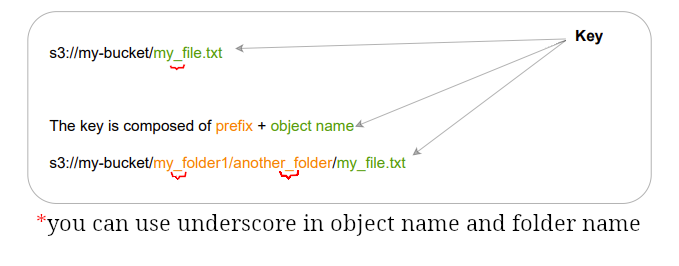
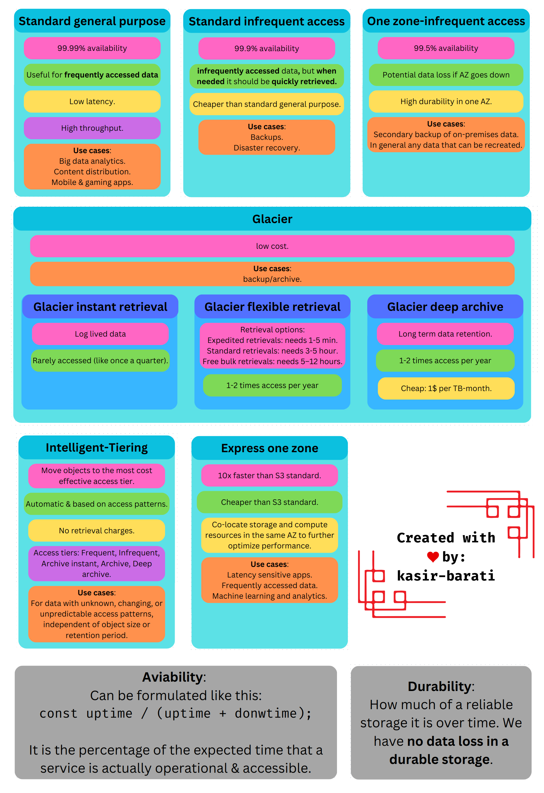

# Simple Storage Service

- AKA S3.
- Infinite scaling capability.
- One of the most important services in AWS.
- Leveraged internally by AWS for integrating other services.
- | Use cases                        |
  | -------------------------------- |
  | Backup.                          |
  | Storage.                         |
  | Archive.                         |
  | Media hosting.                   |
  | Disaster recovery.               |
  | Application hosting.             |
  | Hybrid cloud storage.            |
  | Data lakes & big data analytics. |

## S3 bucket

- Where we store objects <small>(you could call them files)</small>.
- Its name should be unique globally.

  - Naming conventions:

    | Dos                            | Don'ts            |
    | ------------------------------ | ----------------- |
    | Start with a number or letter  | Uppercase         |
    | Between 3 to 63 character long | Underscore        |
    |                                | IP address        |
    |                                | `xn--*` prefix    |
    |                                | `-s3alias` suffix |

- Restricted to each region (But we can of course you can copy them).

## S3 object

- They're files we've uploaded into our S3 bucket.
- Each object has a key.

  

  - You need to specify object name at upload time. For more inf o about what is valid read [this guideline](https://docs.aws.amazon.com/AmazonS3/latest/userguide/object-keys.html#object-key-guidelines).

- Maximum object size: 5TB:exclamation:
  - For object bigger than 5TB use multi-part upload.
- Can define user/system metadata:

  - They're key-value pairs.
  - Defined it for each object **at the upload time**.
  - You cannot modify object metadata (copy it and change it).
  - System defined ones are used generally by AWS itself.
  - For example we could use it for:

    | System metadata       | User metadata                                                             |
    | --------------------- | ------------------------------------------------------------------------- |
    | Last-Modified.        | The username of the person that uploaded the file.                        |
    | Content-Length.       | Set `s-maxage` to change cache duration for an individual object.         |
    | object creation Date. | Categorizing and searching files within a data lake for faster retrieval. |

  - User-defined metadata is limited to 2 KB in size.

- Learn about tags [here](../README.md#tags-in-aws).

## Static website hosting

- Generated URLs are like:
  - http://bucketa.s3-website-aws-region.amazonaws.com
- For not getting 403:
  - Should be accessible publicly.
  - Read policy.

## S3 versioning

- Can be enabled at the bucket level.
- You can have versioning by enabling it (Version ID).
- Objects prior to versioning will have null as version.
- Roll back to previous version or a specific point in time.
- If you disable it, the previously versioned objects won't be removed.

## S3 replication

- It copies asynchronously.
- Must have versioning enabled.
- Can replicate from same/different account into each other.
- For this to work we need to grant the right IAM permissions.
- Same-region replication (SRR): Useful for log aggregation, and replicate data from prod to test env.
- Cross-region replication (CRR): Useful for compliance, lower latency access, and data replication.

## S3 security

| User based                                                                                                    | Resource based                                                 |
| ------------------------------------------------------------------------------------------------------------- | -------------------------------------------------------------- |
| Define IAM policies for the user.                                                                             | Defined bucket wide: Bucket [ACL](../glossary.md#aclGlossary). |
| IAM principal can access S3 objects if: `Statement.Effect: ALLOW` & **no** explicit `Statement.Effect: DENY`. | Object level: Object [ACL](../glossary.md#aclGlossary).        |

### S3 bucket policy example

- We can either:

  1. Block all accesses to a bucket.

     - In this case for seeing objects you need:

       - A pre-signed URL.
       - A bucket policy which allows us to retrieve objects. [You can see one here](../IAM/README.md#iam-policy-structure).

  2. Make it publicly accessible.

- IAM access analyzer for S3:
  - It alerts us whenever it detects a potential vulnerability in our access configurations.
  - Enables us to see access patterns to a bucket.

## S3 encryption

<table>
  <thead>
    <tr>
      <th></th>
      <th>Server-side</th>
      <th>Client-side</th>
    </tr>
  </thead>
  <tbody>
    <tr>
      <th>Done by</th>
      <td>AWS.</td>
      <td>Us (users).</td>
    </tr>
    <tr>
      <th>Encryption types</th>
      <td>
        <ul>
          <li>SSE-S3 (Amazon S3 managed keys).</li>
          <li>SSE-KMS (AWS key management service keys).</li>
          <li>DSSE-KMS (Dual-layer server-side encryption with AWS KMS keys).</li>
        </ul>
      </td>
      <td>
        It is done by us, so you're free to choose whatever bests suits your
        need.
      </td>
    </tr>
    <tr>
      <th>JFI</th>
      <td>Encrypts before saving the object. Decrypts before download.</td>
      <td>
        This is something we can do for example when we have to comply with some
        regulatory laws.
      </td>
    </tr>
  </tbody>
</table>

> [!NOTE]
>
> If you need it you can do both. There is no limitation from the AWS point of view, but you might wanna consider how costly it would be if everything should be encrypted.

## S3 storage classes

- Standard-general purpose.
- Standard-infrequent access.
- One zone-infrequent access.
- Glacier.
  - Glacier instant retrieval.
  - Glacier flexible retrieval.
  - Glacier deep archive.
- Intelligent-Tiering.
- Express one zone.

## Shared responsibility model for S3

| AWS                                          | User                  |
| -------------------------------------------- | --------------------- |
| Vulnerability analysis.                      | Bucket policies.      |
| Compliance validations.                      | Replication setup.    |
| Infrastructure management.                   | Activate versioning.  |
| Ensuring that AWS employees cannot see data. | Monitoring & logging. |
