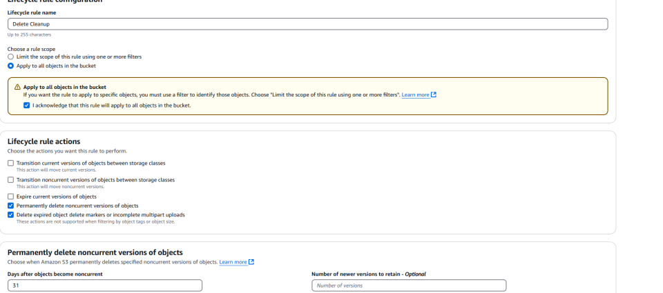
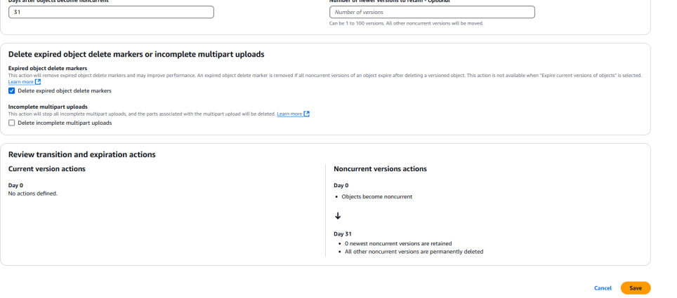
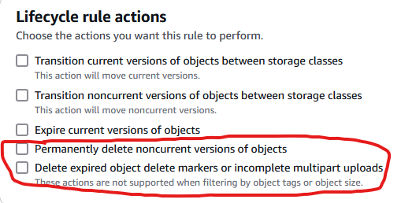

# Lifecycle Rules

- Assume you have a S3 bucket with versioning.
- Now you need to keep all the data until it is deleted.
  - A data lifecycle management rule that will remove those object that were deleted 31 days after the it was deleted.
- Basically retaining deleted data (noncurrent version in AWS language) for only 31 days, then purging it.

So here is what is happening:

1. A file is deleted with versioning enabled.
2. No version is specified.
3. The latest version of the file gets replaced with a delete marker.
   1. This makes the delete marker the current version of the file.
   2. You then set a rule that deletes noncurrent versions of the file.
   3. Anything prior to the delete marker after 31 days.
   4. Then delete the expired delete marker once there is no long any other versions of the file.

Essentially once the delete marker is orphaned it is considered expired and can be deleted.

- Those are the two options we need.
- Noncurrent means if you've uploaded a newer version of a file.
- An older version still exists (noncurrent).
- Expired object delete markers means objects are gone but their delete markers are still there. That will delete them completely and most likely match what we want AWS S3 to do.

## Ref

- [Discord, AWS server, S3 - Cleanup Delete Markers/Files](https://discord.com/channels/423842546947457024/1340020791722377256/1340020791722377256).
