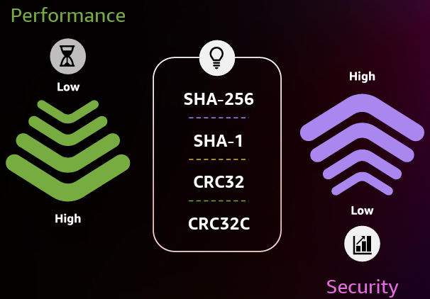

# Multipart File Upload in AWS S3

> [!CAUTION]
>
> You might get busted by a surprise bill if you miss [this](../../no-surprise-bill/s3-multipart-upload.md).

- Upload a single object as a set of parts.
- Each part is a contiguous portion of the object's data.
- Upload these object parts independently and in any order.
- Failed to upload one part? retransmit that part without affecting other parts.

## When You Should Use Multipart?

When your object size reaches 100 MB, you should consider using multipart uploads instead of uploading the object in a single operation.

## Checksums

- Verifies that assets are not altered when they are copied.
- Perform these integrity checks as a durability best practice.
- For supported checksum algorithms look at [this part](#checksum-type).

> [!TIP]
>
> You wanna upload something:
>
> 1. Use a **precalculated checksum**.
> 2. Use the **full object checksum type**.

### Checksum Types

- **Full object checksums**: Calculated based on all of the content of a multipart upload, covering all data from the first byte of the first part to the last byte of the last part.
- **Composite checksums**: They are being calculated based on each part's checksums. In other word it is a checksum of checksums as described in the following videos:
  - [Get Started With Checksums in Amazon S3 for Data Integrity Checking - AWS Online Tech Talks](https://youtu.be/JGsdvDPSirU?t=1468).
  - [AWS S3 Single & Multipart Upload with Verification](https://youtu.be/Te6s1VZPGfk?t=510).
- In this step we can specify the checksum algorithm that Amazon S3 should use & the checksum type (full object or composite).

| Checksum algorithm | Full object | Composite |
| ------------------ | ----------- | --------- |
| `CRC64NVME`        | Yes         | No        |
| `CRC32`            | Yes         | Yes       |
| `CRC32C`           | Yes         | Yes       |
| `SHA1`             | No          | Yes       |
| `SHA256`           | No          | Yes       |

**Full object checksums in multipart uploads are only available for CRC-based checksums because they can linearize into a full object checksum**.

- Provide the checksum algorithm for the `MultipartUpload` API.
- No need to track part boundaries for uploaded objects.

> [!TIP]
>
> To generate those checksums on your Linux you can simply execute one of these:
>
> ```bash
> shasum -a 256 filename.ext | cut -f1 -d\ | xxd -r -p | base64
> ```
>
> I still dunno how to generate a CRC32 checksum hash in terminal. So feel free to file an issue and lemme know how I can do it.

### How To Use The `FULL_OBJECT` Checksum Type

1. You choose a checksum algorithm when you wanna start uploading your data.
2. Calculate the checksum of your file:
   - Read the file chunk by chunk and try to upload them, but at the same time you will calculate the checksum. So no need to read the entire file.
   - We're not gonna use the checksum itself, but rather a hash of it as I've already explained it [here](https://stackoverflow.com/a/79440513/8784518). Feel free to upvote my answer there :).
3. Amazon S3 uses that algorithm to compute a checksum on its own servers and validates it with the provided value by you.
   - Amazon S3 also stores the checksum as part of the object metadata.

#### Which Checksum Algorithm Should You Pick?



- How costly it is to generate the checksum of the entire file before uploading the file?
- How large is your file?

To answer those questions you should know that:

- The larger the file the longer it's gonna take for you to generate the checksum.
- The larger the file the more computation power it is gonna need to generate the checksum.
- In some instances (read large files, e.g. 1TB) it is not practical to generate a single checksum for the whole file.

This picture I believe is a nice way to visualize it:


> [!CAUTION]
>
> There are cases where your client have to have a multipart upload and the file might as well be bigger than 5MB. So you can do it with multipart upload, but now you need to have a single precalculated checksum for the whole file. In this case it is a good idea to have a `FULL_OBJECT` checksum type. For this you only can use CRC-based algorithms.

## Process

> [!TIP]
>
> See how you can do it in NestJS [here](https://github.com/kasir-barati/nestjs-materials/tree/main/microservices/grpc/apps/file-upload). Do not forget to gimme a star :).

1. A CreateMultipartUpload call to start the process.

   - [CreateMultipartUpload](https://docs.aws.amazon.com/AmazonS3/latest/API
     API_CreateMultipartUpload.html) API doc.
   - [CreateMultipartUploadCommand](https://docs.aws.amazon.com
     AWSJavaScriptSDK/v3/latest/client/s3/command/CreateMultipartUploadCommand/) JavaScript SDK doc.
   - In this step we need to specify the **checksum algorithm** and the **full object checksum type**. Find more details on that in the next "note".

2. As many individual UploadPart calls as needed.- **General doc**: [UploadPart](https://docs.aws.amazon.com/AmazonS3/latest/API
   API_UploadPart.html).

- **JS SDK doc**: [UploadPartCommand](https://docs.aws.amazon.com/AWSJavaScriptSDK/v3
  latest/client/s3/command/UploadPartCommand/).

3. A CompleteMultipartUpload call to complete the process.

- **General doc**: [CompleteMultipartUpload](https://docs.aws.amazon.com/AmazonS3/latest
  API/API_CompleteMultipartUpload.html).
- **JS SDK doc**: [CompleteMultipartUploadCommand](https://docs.aws.amazon.com
  AWSJavaScriptSDK/v3/latest/client/s3/command/CompleteMultipartUploadCommand/).

## CreateMultipartUploadCommand

- **This is the first step**.
- Initiates a multipart upload.
- Returns an upload ID.
- Used to associate all of the parts in the specific multipart upload.
- With each UploadPartCommand we will send this ID.
- Used to complete or abort the multipart upload request.
- To stop being charged for storing the uploaded parts, you must either complete or abort the
  multipart upload.
  > [!NOTE]
  >
  > We can have aborting incomplete multipart uploads using a bucket lifecycle configuration
  > ([learn more here](https://docs.aws.amazon.com/AmazonS3/latest/userguide
  > mpuoverview.html#mpu-abort-incomplete-mpu-lifecycle-config)).

## Call UploadPartCommand n Times

- Provide new data as a part of an object in your request.
- We **SHOULD** pass a part number with each request.
- Any number from 1 to 10,000, inclusive.
- It indicates the part's position within the object which will be eventually created if we complete
  the multipart upload.
- AWS will overwrite the part if the part number has already been uploaded for that upload ID.
- Each part should not exceed the amount specified by the AWS S3 max part size ([ref](https:/
  docs.aws.amazon.com/AmazonS3/latest/userguide/qfacts.html)).

## CompleteMultipartUploadCommand or AbortMultipartUploadCommand

- And finally we need to confirm the file upload.

## Refs

- [Tutorial: Upload an object through multipart upload and verify its data integrity](https://docs.aws.amazon.com/AmazonS3/latest/userguide/tutorial-s3-mpu-additional-checksums.html).
