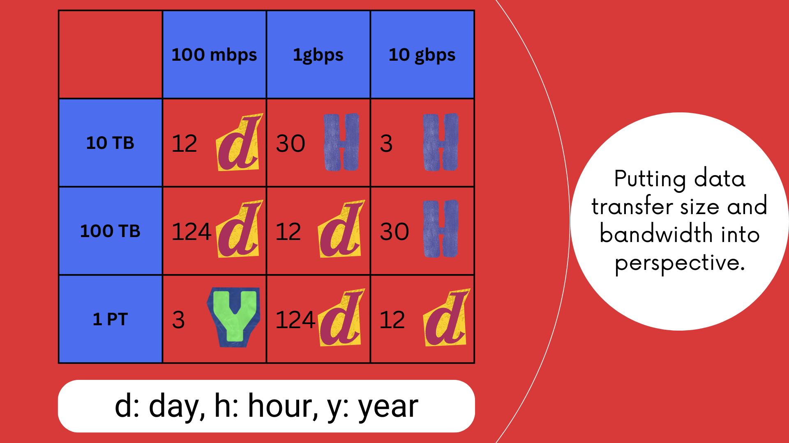

# [Snow Family](https://docs.aws.amazon.com/whitepapers/latest/how-aws-pricing-works/aws-snow-family.html)

- They are physical devices, used to migrate data in and out of AWS.

  |          | Snowcone                               | Snowball                                       |
  | -------- | -------------------------------------- | ---------------------------------------------- |
  | CPU      | 2 CPUs                                 | 104 vCPUs                                      |
  | GPU      | n/a                                    | Optional                                       |
  | RAM      | 4 GB                                   | 416 GB                                         |
  | Storage  | n/a                                    | 28 TB NVMe or 42 TB HDD                        |
  | Use case | Collect, process, and move data to AWS | Can be utilized either for compute or storage. |

- You need compute power near where data is being generated.
- Why do we need it?
  - To prevent data loss on data transfer (physical data transfer).
  - We need to lessen the communications by performing edge processing, can be due to:
    - Bad or limited connectivity.
    - Shared or limited bandwidth.
    - Needs to reduce the network cost[^1].
- Data transfer can be done either offline by shipping the device, or online with AWS DataSync.
- Use [AWS OpsHub](https://docs.aws.amazon.com/snowball/latest/developer-guide/aws-opshub.html) to manage your Snow Family devices. Things like transferring files, launching EC2 instances, etc.

## Edge computing use cases

- Machine learning applications.
- Transcoding[^2] media streams.
- Preprocessing data.

We can do these things with Snow Family since they can launch EC2 instances, and run AWS lambda functions. You can combine Snow Family devices with AWS IoT Greengrass to build IoT solutions and run ML inference on Snow Family devices.

# Footnotes

[^1]: In fact once I was talking to one of my colleague about why our devices where not sending their location to our servers and he explained it to me like this: "With each request going on the network we are paying the 'Mobile Network Operator', and then we need to process and store it too, after that your app asks our platform to send it that data. Finally your client app asks Google Map to send data about each location, and you may know this or not, but Google charges us per each API call."
[^2]: Converting a media file or stream from one format, codec, or bitrate to another. This is done to ensure compatibility with different devices, networks, or platforms ([learn more here](https://corp.kaltura.com/blog/what-is-transcoding/#)).
