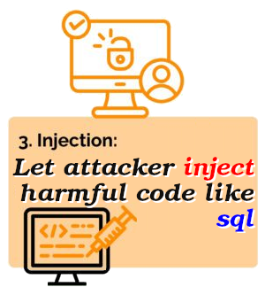
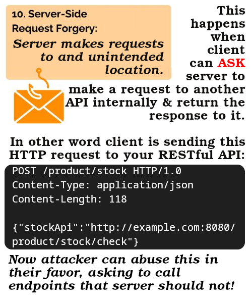
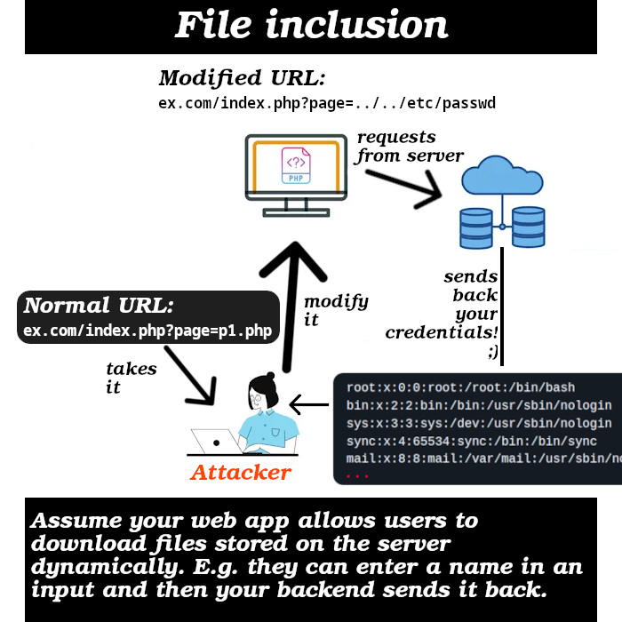

# [WAF & Shield](https://docs.aws.amazon.com/whitepapers/latest/guidelines-for-implementing-aws-waf/guidelines-for-implementing-aws-waf.html)

- WAF stands for **W**eb **A**pplication **F**ramework.
- Charged for rules inside rule groups that are created by you.
- Works on layer 7:

  - Layer 7 = Application Layer.
  - Create rules to to **filter & monitor web requests** based on:
    - Their size.
    - Their location (geo-match).
    - Conditions such as IP addresses, HTTP headers and body, or custom URIs.
    - Rate: A rate-based rule that shields against DDoS by utilizing globally distributed network of AWS edge locations:
      - **Route 53**: Only allow valid DNS requests to reach the service.
      - **CloudFront**: Only allowing valid traffics for web applications to pass through to the service.
  - Protects our app against common web exploits, e.g.:

    - 
    - 

      &mdash; [Ref](https://portswigger.net/web-security/ssrf).

    - 
    - 

  - Deployed on [ALB](./EC2/README.md#alb), API gateway, and CloudFront.

- Create a holistic defense-in-depth architecture with WAF + some other tools.
- Managed service.
- Can be natively enabled on:
  - [CloudFront](../CloudFront/README.md).
  - Amazon API Gateway.
  - Application Load Balancer.
  - AWS AppSync.
