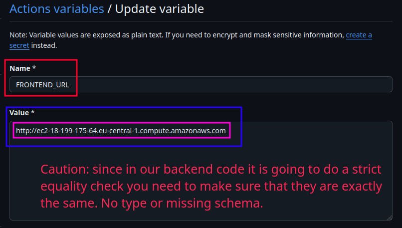

# Manual deployment processes

> [!IMPORTANT]
>
> This is not my favorite way of doing things at all. I just did it since I wanted to get a feeling of the steps you usually need to take.

Here we use Nginx, and NodeJS.

1. [Launch an EC2 instance](../aws/EC2/launching-an-instance.md).
2. If you have not done it while creating EC2 now you can [assign a new security group to your EC2 to open its port 80 to the public](../aws/EC2/security-groups.md#opening-port-80-of-an-ec2-instance).
3. Now ssh to your EC2 instance via the `YourPrivate.pem` key. To do that:

   1. Right click on your EC2 instance and click on connect:

      

   2. And in the new tab click on "SSH client", and there you can find a copy button next to a ssh command with the appropriate key, username and hostname. But if it needs some modifications do not be shy:

      

4. Now head yo your terminal and paste the copied command (make sure your key is located in the same place you're running this command).
5. Then inside the container do a quick update:

   ```shell
   sudo apt update
   ```

6. Install necessary packages:

   ```shell
   sudo apt install nginx nodejs npm -y
   ```

7. <a id="findPublicIpv4DnsInAws" href="#findPublicIpv4DnsInAws">#</a> BTW if you need to access your EC2 instance just go to your instance detailed view page and copy your public IPv4 DNS address and enter it in your browser. Of course since we just installed Nginx in previous step you should see Nginx welcome page.

   

8. Install `n` globally and change your node version to match the one you selected in your GitHub actions:

   ```shell
   sudo npm i --global n
   sudo n 22
   hash -r # To reload your bash command line so that when you run `node -v` it uses node v22.
   ```

9. Install [`pm2`](https://pm2.keymetrics.io/) on your EC2 instance globally:

   ```shell
   sudo npm i --global pm2
   ```

   <details>
     <summary>A few commands you most likely will need while using <code>pm2</code></summary>
     <ul>
       <li>
         <code>pm2 flush processName</code>
         <br />
         This will empty the current application logs managed by PM2.
       </li>
       <li>
         <code>pm2 logs processName</code>
         <br />
         This will log all the logs of that process. Similar to
         <code>docker logs containerName -f</code>.
       </li>
       <li>
         <code>pm2 start script.js --name processName</code>
         <br />
         This will start a new process with the passed name.
       </li>
       <li>
         <code>pm2 delete processName</code>
         <br />
         To delete a process by its name.
       </li>
       <li>
         <code>pm2 restart processName</code>
         <br />
         Restarts an existing process.
       </li>
     </ul>
   </details>

10. <a id="createRepositoryLevelVariable" href="#createRepositoryLevelVariable">#</a> Create a new variable in your GitHub repo named `FRONTEND_URL` and copypaste your ["Public IPv4 DNS"](#findPublicIpv4DnsInAws) as its value:

    1. Go to your repo's page.
    2. Open "Settings".
    3. Navigate to "Secrets and variables" in the sidebar on left hand side and click on "Actions", then switch to "Variables" tab, and finally click on "New repository variable" button:

       

    4. Now we can add a new env variable:

       

11. Then go to your GitHub repo page and create an action to deploy this project to your EC2 instance:

    1. Click on "Actions".
    2. Add a new workflow for your ExpressJS app:

       1. Search for "node".
       2. Pick the one with "Node.js" name:

          

       3. Modify it the way you like. I am just gonna:

          1. As the first step we need to do a quick cleanup for both backend and frontend.
          2. Remove the on pull request event trigger since I do not need it. [Learn more here](https://docs.github.com/en/actions/writing-workflows/choosing-when-your-workflow-runs/events-that-trigger-workflows).

             Instead I add `workflow_dispatch:` to be able to run this workflow manually too. Just in case.

             On another note, since the `actions/setup-node@v4` will look for a `package-lock.json` file in the root of our repo in order to cache the npm installation, and our repo does not have one (it's a monorepo).

             Thus we need to specify where is our `package-lock.json`. Read more [here](https://github.com/actions/setup-node?tab=readme-ov-file#caching-global-packages-data)

          3. Define the default working directory.
          4. Define a workflow environment variable to prevent duplication.
          5. Change the runner from `ubuntu-latest` to `self-hosted`. Indicating our intention of having the steps defined in this workflow to be executed on our EC2 instance.
          6. I just want it to run the steps of jobs in NodeJS version 22. So I removed the other versions.
          7. Since this is a monorepo we need to change our working directory too.
          8. I removed the `npm test` too.
          9. Start/restart the backend on each deploy + flushing pm2 logs.

             Note that we are using [`vars` context](https://docs.github.com/en/actions/writing-workflows/choosing-what-your-workflow-does/accessing-contextual-information-about-workflow-runs#vars-context) to access repository level variable we've created [here](#createRepositoryLevelVariable) as env variable.

          10. Finally move the frontend file to `/var/www/html`. This can be also your `build`/`dist` directory.

          **This is the final product**:

          ```yaml
          name: Self-hosted backend & frontend
          on:
            push:
              branches: ['main']
            workflow_dispatch:
          defaults:
            run:
              working-directory: ./deploying-exercises/expressjs-cors/backend
          env:
            FRONTEND_DEST: /var/www/html
          jobs:
            build:
              runs-on: self-hosted
                strategy:
                  matrix:
                  node-version: [22.x]
                  # See supported Node.js release schedule at https://nodejs.org/en/about/releases/
                steps:
                  - name: Cleanup ${{ env.FRONTEND_DEST }}
                    run: sudo rm -rf $FRONTEND_DEST
                  - name: Cleanup deploying-exercises/expressjs-cors
                    working-directory: ./deploying-exercises/expressjs-cors
                    run: |
                      ls -la .
                      rm -rf * || true
                      ls -la .
                  - uses: actions/checkout@v4
                  - name: Use Node.js ${{ matrix.node-version }}
                    uses: actions/setup-node@v4
                    with:
                      node-version: ${{ matrix.node-version }}
                      cache-dependency-path: deploying-exercises/expressjs-cors/backend/package-lock.json
                      cache: 'npm'
                  - run: npm ci
                  - run: npm run build --if-present
                  - run: echo "FRONTEND_URL=${{ vars.FRONTEND_URL }}" >> .env
                  - name: Clean old logs of backend
                    continue-on-error: true
                    run: pm2 flush backend
                  - name: Restart the process on each new deploy or start the process if it does not exist
                    run: pm2 restart backend || pm2 start index.js --name backend
                  - name: Move Frontend to ${{ env.FRONTEND_DEST }}
                    run: |
                      sudo mv ./frontend $FRONTEND_DEST
                      sudo chown -R root:root $FRONTEND_DEST
                    working-directory: ./deploying-exercises/expressjs-cors
          ```

       4. Change the file name to `self-hosted.yml` & commit it.

12. Create a self hosted runner in GitHub:

    1. To do that got to "Settings" tab in your GitHub repo.
    2. On the left, inside the sidebar you click on "Actions" and then "Runners":

       

    3. In order to have a functional self-hosted runner you need to download, configure, and execute the **GitHub Actions Runner**. So we need to follow the instructions written down under the "Download" section:

       

       Following those steps:

       

       **☝️ Note that we've accepted the default path for where our artifacts will be generated and pushed which is `_work`. Meaning if you cd into it and run `ls` you should be able to see a directory with your repository's name ☝️**.

       > [!CAUTION]
       >
       > We diverge a little bit since we are on Linux and use [`systemd`](https://en.wikipedia.org/wiki/Systemd). After we've executed `./config.sh ...` we need to do the following steps:
       >
       > 
       >
       > - I tried to follow GitHub's steps and ran `./run.sh` but it did not work.
       > - `svc.sh`:
       >   - Set up the self-hosted runner application to run automatically when your machine starts.
       >   - Available on Linux systems with `systemd`.
       >   - `svc.sh` script has been created after adding the runner.
       >   - Use it to install and manage the ["runner as a service"](./glossary.md#runnerAsAServiceGlossary):
       >     - `sudo ./svc.sh install` installs the service.
       >     - `sudo ./svc.sh start` starts the service.

    4. Finally after a couple of minutes if you go back to "Runners" tab in "Settings" you should see something like this:

       

> [!CAUTION]
>
> Before removing your EC2 instance it is better to first uninstall the self-hosted runner and let GitHub to do some cleanups. Just go to your GitHub repo and "Settings" tab, click on "Runners" and delete runner.

13. Now it is time to move on and configure our Nginx to show our frontend app:

    1. ```shell
       sudo nano /etc/nginx/sites-available/default
       ```

       Add a [`location` block directive](http://nginx.org/en/docs/http/ngx*http_core_module.html#location) for the backend right after `server_name *;`:

       ```nginx
       location /api/ {
         proxy_pass       http://localhost:3000;
         proxy_set_header Host            $host;
         proxy_set_header X-Real-IP       $remote_addr;
         proxy_set_header X-Forwarded-For $proxy_add_x_forwarded_for;
       }
       ```

       > [!CAUTION]
       >
       > Keep your `APP_PORT` number in your backend app's env variable in line with the number entered here. Worth mentioning that its default value is 3000.

    2. Save changes and then reload Nginx:

       ```shell
       sudo systemctl reload nginx
       ```

       > [!NOTE]
       >
       > Note that I do not like restarting this service since if you've made any sort of mistake reload will yell at you and won't kill the old process unless it is sure there is no syntax error in your nginx config file.

## 404 -- Nginx issue

1. Check whether I can access my backend.
2. Check the `systemctl` logs for nginx: `sudo systemctl status nginx`.
3. Check Nginx logs: `cat /var/log/nginx/error.log`.
4. Checked the current `chmod`:

   

5. `sudo chmod -R 0755 frontend` did not help! I also tried to change it to 777 bu no luck. I did not go too crazy about it as to changing the whole path permissions: `/home/ubuntu/actions-runner/_work/cloud/cloud/deploying-exercises/expressjs-cors`.

   

6. Next I tried to change their group: `sudo chown -R "$USER":www-data` but it did not work. Thus I decided to try a completely different approach, moving my frontend code to `/var/www/html` and changing its permissions + groups in a step in my GitHub workflow.

   **And this solution actually worked, so here is what I did:**

   1. Change `root` directive in my Nginx config back to `root /var/www/html`.
   2. Removed everything inside it and moved my frontend app into it instead + changing ownership too. This was done via GitHub actions, [see this to see all changes in one place](https://github.com/kasir-barati/cloud/blob/f71dfb7401137603bda9eaf42bff32bf91d6881e/.github/workflows/self-hosted.yml#L15-L16).

> [!CAUTION]
>
> - Do **NOT** try to resort to `chmod 777`. But if you're just trying to make sure that is not causing you this issue it is fine.
> - Sometime you need to do a hard refresh in your browser + restarting Nginx on your server.
> - About `chmod` you need to keep in mind that **the whole full path to your final folder must be accessible!**
